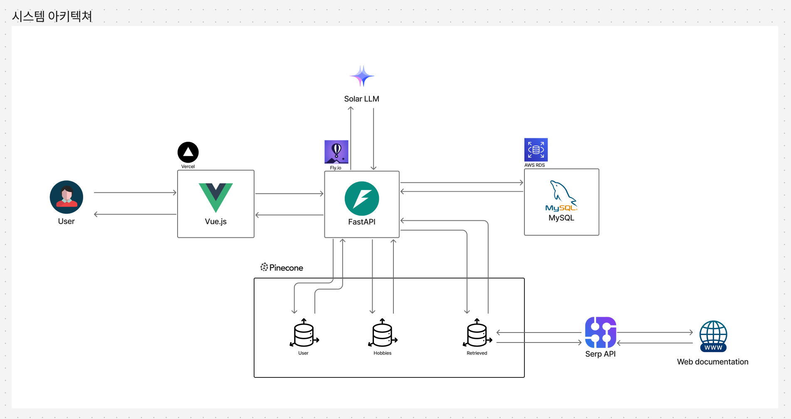

<h1 align="center">
     
    
     
    My Hobby
     
</h1>
<h4 align="center">챗봇 대화 기반 사용자 성향 파악 및 취미 추천 서비스</h4>
 

## 컨텐츠 목록
- [소개](#-소개)
- [사용법](#-사용법)
- [주요 기능 요약](#-주요-기능-요약)
- [아키텍처](#-아키텍처)
- [RAG 파이프라인](#-Salt-Hashing)
- [문제 및 개선](#-Hashing-비용-증가)
   - [Lazy](#-Hashing-시간-고정)
   - [RAG 파이프라인 개선](#-개선안)

## 👋 소개
**My Hobby**는 삼성 청년 SW·AI 아카데미에서 진행한 프로젝트로, 챗봇 대화를 통해 사용자 성향을 파악하고 맞춤 취미를 추천하는 서비스입니다. 추천된 취미와 유사한 활동들을 벡터 기반 유사도 비교를 통해 제안하며, 각 취미에 대한 상세 정보와 관련 이미지를 함께 제공합니다.
- **역할**: FastAPI 기반 백엔드 개발, RAG파이프라인 설계 및 구현
- **팀원**: [오승언](https://github.com/suee97), [김민주](https://github.com/KimMinjuAstro), [김준혁](https://github.com/peridot0810), [박정현](https://github.com/junghyun0729), [하헌석](https://github.com/rickyhi99)
- **진행 기간**: 2025.06.04 ~ 2025.07.04
- **원본 레포지토리**: https://github.com/hobby-recommendation-chatbot/backend

## 사용법
1. **홈 화면 접속**  
   [https://myhobby-chatbot.vercel.app/](https://myhobby-chatbot.vercel.app/) 에 접속합니다.

2. **성향 진단 시작**  
   - 챗봇의 질문에 따라 성격, 관심사, 생활 패턴 등의 정보를 대화 형식으로 입력합니다.  
   - 예: "혼자 있는 걸 선호하나요?" → "네 / 아니오"

3. **취미 추천 결과 확인**    
   - 입력한 정보를 기반으로 개인 맞춤 취미가 추천됩니다.  
   - 추천 결과에는 관련 이미지, 준비물, 추가 정보 등이 포함됩니다.

4. **유사 취미 탐색**  
   - 추천된 취미와 유사한 다른 활동들도 함께 확인할 수 있습니다.  
   - 유사도 기반으로 관련 취미가 자동 제안됩니다.

## 주요 기능 요약
- 대화 기반 사용자 성향 분석
- 유사 사용자 기반 1차 취미 추천
- 벡터 유사도 기반 2차 유사 취미 추천
- 각 취미의 상세 정보, 준비물 및 이미지 제공
- SerpAPI 기반 실시간 검색 결과를 활용한 추가 정보 제공

## 📐 아키텍처

## RAG 파이프라인

## 문제 및 개선
***Logic(취미추천) = 취미 목록 추천***  
***Logic(상세) = 취미 상세 정보 검색, 임베딩 및 저장, 유사성 기반 조회***  
***T = 취미 하나에 대한 상세 정보까지 확인하는 시간*** 

개선 전 서비스는 Logic(취미추천)과 Logic(상세)이 한 번에 수행되어, 추천 취미 하나의 상세 정보까지 확인하는 데 3분 이상이 소요되었습니다. 이는 사용성 측면에서 치명적인 문제였기에, 다음 과정을 통해 이를 개선했습니다.

## 로직 분리(Lazy 방식 접근)
  
Logic(취미추천)과 Logic(상세)을 서비스 차원에서 분리하여, 사용자가 취미를 선택했을 때만 Logic(상세)를 수행하도록 변경했습니다. 이를 통해 사용자는 모든 결과를 기다리는 대신, 추천 취미 목록을 먼저 빠르게 응답받고 원하는 취미에 대한 상세 정보만을 요청할 수 있게 되었습니다.

 

개선 효과: ***T*** (응답 시간) 2분 20초 이상 감소

## RAG 파이프라인 개선
기존 Logic(상세)는 실시간성 반영을 위해 취미를 추천할 때마다 웹 크롤링 → 임베딩 → 조회 로직을 수행했습니다. 하지만 임베딩에 많은 시간이 소요되어 응답 시간이 지연되었고, VectorDB에는 무한히 데이터가 쌓이는 문제가 있었습니다. 따라서 특정 시간마다 모든 취미 상세 정보를 미리 검색 및 임베딩하여 실시간성을 유지하고 성능을 개선했습니다.

개선 효과: ***T*** (응답 시간) 10초 이상 감소
